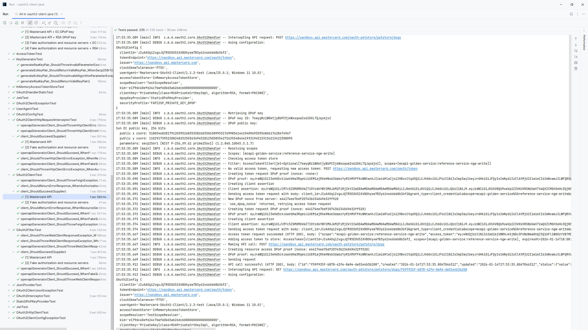

# OAuth2 Client Java

<picture>
  <source media="(prefers-color-scheme: dark)" srcset="https://developer.mastercard.com/_/_/src/global/assets/svg/mcdev-logo-light.svg">
  
</picture>

## Overview

Easily access Mastercard APIs with OAuth 2.0 and FAPI 2.0. This zero-dependency library handles authentication for you.

For more information, see [Using OAuth 2.0 to Access Mastercard APIs](https://mstr.cd/43CuHBY).

## Requirements

### License

[](LICENSE)

This project is licensed under the Apache License 2.0.

### Java

[](https://github.com/mastercard/oauth2-client-java/actions/workflows/ci-java-lts.yml)

To use this project, you will need Java 17 or higher. Java 17 is an LTS release and has become the practical baseline for modern Java frameworks (for example Spring Boot 3).

### Zero-Dependency

The code is compiled using "provided" dependencies to keep the artifact small, prevent version conflicts, and let you choose which HTTP client and JSON provider to use at runtime.

The modular structure lets you import only what you need. For example, when using OkHttp and classes from the `okhttp3` package, only the OkHttp library needs to be on the classpath.

At least one JSON library (Jackson, Gson, or org.json) must be available on the classpath for JSON processing.

To verify that runtime dependencies are minimal, run `cd library && mvn dependency:tree -Dscope=runtime`. Expected output:

```
[INFO] --- dependency:3.7.0:tree (default-cli) @ oauth2-client-java ---
[INFO] com.mastercard.developer:oauth2-client-java:jar:{version}
[INFO] \- org.slf4j:slf4j-api:jar:{version}:compile
```

## Documentation

[](https://javadoc.io/doc/com.mastercard.developer/oauth2-client-java)
[](https://deepwiki.com/Mastercard/oauth2-client-java)
[](https://context7.com/mastercard/oauth2-client-java?tab=chat)


A Javadoc site is available on javadoc.io. Additionally, you can use DeepWiki and Context7 to explore the library further.

## Usage

### Maven dependency

[](https://search.maven.org/artifact/com.mastercard.developer/oauth2-client-java)

To start, add the following dependency to your project:

#### Maven POM
```xml
<dependency>
    <groupId>com.mastercard.developer</groupId>
    <artifactId>oauth2-client-java</artifactId>
    <version>${oauth2-client-version}</version>
</dependency>
```

#### Gradle Build File
```
dependencies {
    implementation "com.mastercard.developer:oauth2-client-java:$oauth2ClientVersion"
}
```

### Configuration

The [`OAuth2Config`](./library/src/main/java/com/mastercard/developer/oauth2/config/OAuth2Config.java) object contains your client credentials, DPoP key configuration, token endpoint, and other settings for OAuth 2.0 authentication. 

Here's how to build an instance:

```java
PrivateKey clientKey = KeyLoader.loadPrivateKey(Paths.get("path/to/client-private-key.pem"));
KeyPair dpopKeyPair = KeyLoader.loadKeyPair(Paths.get("path/to/dpop-private-key.json")); // Or KeyGenerator.generateEcKeyPair("secp256r1");

OAuth2Config config = OAuth2Config.builder()
    .securityProfile(SecurityProfile.FAPI2SP_PRIVATE_KEY_DPOP)
    .clientId("ZvT0sklPsqzTNgKJIiex5_wppXz0Tj2wl33LUZtXmCQH8dry")
    .tokenEndpoint(new URL("https://sandbox.api.mastercard.com/oauth/token"))
    .issuer(new URL("https://sandbox.api.mastercard.com"))
    .clientKey(clientKey)
    .kid("302449525fad5309874b16298f3cbaaf0000000000000000")
    .accessTokenStore(new InMemoryAccessTokenStore())
    .scopeResolver(new StaticScopeResolver(Set.of("service:scope1", "service:scope2")))
    .dpopKeyProvider(new StaticDPoPKeyProvider(dpopKeyPair))
    .clockSkewTolerance(Duration.ofSeconds(10))
    .build();
```

Notes:
* All credentials shown here are examples from [Using OAuth 2.0 to Access Mastercard APIs](https://mstr.cd/43CuHBY). Replace them with your own.
* For more information on scope resolvers, DPoP key providers, and access token stores, see [Extension Points](#extension-points).

### Low-Level API

The [`OAuth2Handler`](./library/src/main/java/com/mastercard/developer/oauth2/core/OAuth2Handler.java) class provides public static methods that handle client assertion generation, DPoP proof creation, access token request creation and access token response parsing.

### Supported HTTP Clients

For a higher-level experience, use the provided HTTP-client related classes (interceptors, filters, or client wrappers), automatically invoking the `OAuth2Handler` logic under the hood. 

Pick the HTTP client that works best for your application. All implementations provide the same functionality.

#### OkHttp

| Supported versions | Status                                                                                                                                                                                                           |
|--------------------|------------------------------------------------------------------------------------------------------------------------------------------------------------------------------------------------------------------|
| 4.x, 5.x           | [](https://github.com/mastercard/oauth2-client-java/actions/workflows/ci-okhttp.yml)                         |


The `OAuth2Interceptor` is an OkHttp interceptor that adds access tokens and DPoP proofs to outgoing requests. Register it with `OkHttpClient.Builder.addInterceptor()`.

##### The [`OAuth2Interceptor`](./library/src/main/java/com/mastercard/developer/oauth2/http/okhttp3/OAuth2Interceptor.java) Class

```java
OkHttpClient httpClient = new OkHttpClient.Builder()
        .addInterceptor(new OAuth2Interceptor(config, baseClient.newBuilder()))
        .build();
Call call = httpClient.newCall(request);
Response response = call.execute();
```

##### OpenAPI Generator: `okhttp-gson`

```java
OkHttpClient httpClient = new OkHttpClient.Builder()
        .addInterceptor(new OAuth2Interceptor(config, baseClient.newBuilder()))
        .build();
var client = new ApiClient(httpClient);
client.setBasePath(baseUri);
var api = new ResourcesApi(client);
Resource resource = api.createResource(new Resource());
```

#### Java HTTP Client

| Supported versions | Status                                                                                                                                                                                                        |
|--------------------|---------------------------------------------------------------------------------------------------------------------------------------------------------------------------------------------------------------|
| Java 17 to 25      | [](https://github.com/mastercard/oauth2-client-java/actions/workflows/ci-java-http-client.yml)  |


`OAuth2HttpClient` extends `HttpClient` and provides a builder that extends `HttpClient.Builder`. Use it as a drop-in replacement for the standard Java HTTP client.

##### The [`OAuth2HttpClient`](./library/src/main/java/com/mastercard/developer/oauth2/http/java/OAuth2HttpClient.java) Class

```java
HttpClient httpClient = OAuth2HttpClient.newBuilder(config, baseBuilder).build();
HttpResponse<String> response = httpClient.send(request, HttpResponse.BodyHandlers.ofString());
```

##### OpenAPI Generator: `native`

```java
var client = new ApiClient();
client.setHttpClientBuilder(OAuth2HttpClient.newBuilder(config, baseBuilder));
client.updateBaseUri(baseUri);
var api = new ResourcesApi(client);
Resource resource = api.createResource(new Resource());
```

#### Apache HttpClient

| Supported versions  | Status                                                                                                                                                                                                         |
|---------------------|----------------------------------------------------------------------------------------------------------------------------------------------------------------------------------------------------------------|
| 5.4.x, 5.5.x, 5.6.x | [](https://github.com/mastercard/oauth2-client-java/actions/workflows/ci-apache-httpclient.yml) |

`OAuth2HttpClient` extends `CloseableHttpClient`. It wraps request execution to add access tokens and DPoP proofs before sending requests.

##### The [`OAuth2HttpClient`](./library/src/main/java/com/mastercard/developer/oauth2/http/apache/OAuth2HttpClient.java) Class

```java
CloseableHttpClient httpClient = new OAuth2HttpClient(config);
ClassicHttpResponse httpResponse = httpClient.execute(request, response -> handleResponse(response));
```

##### OpenAPI Generator: `apache-httpclient`

```java
CloseableHttpClient httpClient = new OAuth2HttpClient(config);
var client = new ApiClient(httpClient);
client.setBasePath(baseUri);
var api = new ResourcesApi(client);
Resource resource = api.createResource(new Resource());
```

#### OpenFeign

| Supported versions | Status                                                                                                                                                                                                |
|--------------------|-------------------------------------------------------------------------------------------------------------------------------------------------------------------------------------------------------|
| 11.1+, 12.x, 13.x  | [](https://github.com/mastercard/oauth2-client-java/actions/workflows/ci-feign.yml)                |

`OAuth2Client` implements Feign's `Client` interface. It intercepts requests to add access tokens and DPoP proofs. It can be passed to `Feign.Builder.client()`.

##### The [`OAuth2Client`](./library/src/main/java/com/mastercard/developer/oauth2/http/feign/OAuth2Client.java) Class

```java
Client feignClient = new OAuth2Client(config);
HttpResponse<String> response = feignClient.execute(request, new Request.Options());
```

##### OpenAPI Generator: `feign`

```java
Client feignClient = new OAuth2Client(config);
var client = new ApiClient();
client.getFeignBuilder().client(feignClient);
client.setBasePath(baseUri);
ResourcesApi api = client.buildClient(ResourcesApi.class);
Resource resource = api.createResource(new Resource());
```
#### Spring WebClient

| Supported versions                          | Status                                                                                                                                                                                                         |
|---------------------------------------------|----------------------------------------------------------------------------------------------------------------------------------------------------------------------------------------------------------------|
| `spring-webflux` 6.0.x, 6.1.x, 6.2.x, 7.0.x | [](https://github.com/mastercard/oauth2-client-java/actions/workflows/ci-spring-webclient.yml)   |


`OAuth2Filter` implements `ExchangeFilterFunction`. It intercepts requests to add access tokens and DPoP proofs. Register it with `WebClient.Builder.filter()`.

##### The [`OAuth2Filter`](./library/src/main/java/com/mastercard/developer/oauth2/http/spring/webclient/OAuth2Filter.java) Class

```java
var filter = new OAuth2Filter(config);
WebClient webClient = WebClient.builder().filter(filter).build();
ResponseSpec response = webClient.get().uri(uri).retrieve();
```

##### OpenAPI Generator: `webclient`

```java
var filter = new OAuth2Filter(config);
WebClient webClient = WebClient.builder().filter(filter).build();
var client = new ApiClient(webClient);
client.setBasePath(baseUri);
var api = new ResourcesApi(client);
Resource resource = api.createResource(new Resource());
```

#### Spring RestClient

| Supported versions        | Status                                                                                                                                                                                                         |
|---------------------------|----------------------------------------------------------------------------------------------------------------------------------------------------------------------------------------------------------------|
| `spring-web` 6.2.x, 7.0.x | [](https://github.com/mastercard/oauth2-client-java/actions/workflows/ci-spring-restclient.yml) |

`OAuth2ClientHttpRequestInterceptor` implements `ClientHttpRequestInterceptor`. It intercepts requests to add access tokens and DPoP proofs. Register it with `RestClient.Builder.requestInterceptor()`.

##### The [`OAuth2ClientHttpRequestInterceptor`](./library/src/main/java/com/mastercard/developer/oauth2/http/spring/restclient/OAuth2ClientHttpRequestInterceptor.java) Class

```java
var interceptor = new OAuth2ClientHttpRequestInterceptor(config);
RestClient restClient = baseBuilder.requestInterceptor(interceptor).build();
ResponseSpec response = restClient.get().uri(uri).retrieve();
```

##### OpenAPI Generator: `restclient`

```java
var interceptor = new OAuth2ClientHttpRequestInterceptor(config);
RestClient restClient = baseBuilder.requestInterceptor(interceptor).build();
var client = new ApiClient(restClient);
client.setBasePath(baseUri);
var api = new ResourcesApi(client);
Resource resource = api.createResource(new Resource());
```
## Test Strategy

Each [supported HTTP client](#supported-http-clients) has two types of tests:

1. Direct HTTP client usage: tests that exercise the HTTP client directly 
2. OpenAPI Generator integration: tests that validate compatibility with API clients generated at build time (see [`test-clients`](./test-clients/pom.xml) module)

Both types run against a real service and fake servers.

### Real Service

#### Local Development

Running integration tests against a real Mastercard API requires API details and credentials. For that:

1. Run: `cp`[`.env.example`](./.env.example)`.env`
2. Update `.env` with the required values

#### GitHub Actions

This repository is configured with the following secrets GitHub Actions automatically uses when running [workflows](https://github.com/mastercard/oauth2-client-java/actions):

<picture>
  <source media="(prefers-color-scheme: dark)" srcset="./res/secrets-dark.svg">
  
</picture>

### Fake Servers

Fake servers use [WireMock](http://wiremock.org/) to simulate OAuth 2.0 authorization and protected API resource servers.
See: [`FakeAuthorizationServer`](./library/src/test/java/com/mastercard/developer/oauth2/test/mocks/FakeAuthorizationServer.java), [`FakeResourceServer`](./library/src/test/java/com/mastercard/developer/oauth2/test/mocks/FakeResourceServer.java).

## Extension Points

This library is small by design and built to be extended. Common extension points are listed below.

### [`ScopeResolver`](./library/src/main/java/com/mastercard/developer/oauth2/core/scope/ScopeResolver.java)

- Implement `ScopeResolver` to control which scopes are requested for a given URL or endpoint
- Use `StaticScopeResolver` for simple fixed-scope cases

### [`DPoPKeyProvider`](./library/src/main/java/com/mastercard/developer/oauth2/core/dpop/DPoPKeyProvider.java)

- Implement `DPoPKeyProvider` to supply keys for DPoP proofs
- Use `StaticDPoPKeyProvider` for a single, static key
- For short-lived DPoP keys, implement a provider that returns different keys over time

### [`AccessTokenStore`](./library/src/main/java/com/mastercard/developer/oauth2/core/access_token/AccessTokenStore.java)

- Implement `AccessTokenStore` to control how access tokens are cached and retrieved
- Use `InMemoryAccessTokenStore` for a simple, thread-safe in-memory cache

## Troubleshooting

To see logs from this library, include an SLF4J implementation (e.g. Logback, Log4j 2, or slf4j-simple) in your application's dependencies. If you already use a framework like Spring Boot, you likely already have one. Otherwise, you must choose and configure one. Without it, SLF4J will silently discard all logs (no output).

<picture>
  <source media="(prefers-color-scheme: dark)" srcset="./res/logger-dark.png">
  
</picture>

## Code Style

[](https://github.com/mastercard/oauth2-client-java/actions/workflows/prettier.yml)

Java formatting is automatically enforced using the [Spotless Maven Plugin](https://github.com/diffplug/spotless/tree/main/plugin-maven) (configured with [Prettier Java](https://github.com/jhipster/prettier-java)).

### Setup

1. Install Node.js and npm if not already present
2. (Recommended) Install the [File Watchers plugin](https://plugins.jetbrains.com/plugin/7177-file-watchers) for IntelliJ

### Check Formatting

To check if the code complies with the style formatting:
```
cd library && mvn spotless:check
```

### Apply Formatting

To automatically format the code:
```
cd library && mvn spotless:apply
```

### IDE Integration

- The File Watchers plugin can format `.java` files on save

- See watcher configuration in [`watcherTasks.xml`](./.idea/watcherTasks.xml)
